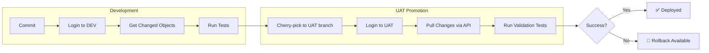

# IICS CI/CD Pipeline

[](https://www.python.org/downloads/)
[](https://opensource.org/licenses/MIT)

A CI/CD pipeline for **Informatica Intelligent Cloud Services (IICS)** using GitHub Actions. Automates the promotion of assets from Development to UAT environments.

## 🔄 Pipeline Flow



## 🚀 Quick Start

### Prerequisites

1. **IICS Environments**: Access to Development and UAT organizations
2. **GitHub Secrets**: Configure in repository settings

| Secret | Description |
|--------|-------------|
| `IICS_USERNAME` | Development Org username |
| `IICS_PASSWORD` | Development Org password |
| `UAT_IICS_USERNAME` | UAT Org username |
| `UAT_IICS_PASSWORD` | UAT Org password |
| `GH_TOKEN` | Personal Access Token for git operations |

### Installation

```bash
# Clone repository
git clone https://github.com/nrislani/IICS_CICD_PIPELINE.git
cd IICS_CICD_PIPELINE

# Install dependencies
pip install -r requirements.txt

# For development (with test tools)
pip install -e ".[dev]"
```

### Trigger Deployment

1. Go to **Actions** tab in GitHub
2. Select **DEPLOY_MAPPING_TASK** workflow
3. Click **Run workflow** with:
   - **Commit Hash**: The hash to promote
   - **Repository Name**: `owner/repo` (default: `nrislani/iics`)
   - **Resource Type**: `MTT` (Mapping Task) or `DSS` (Sync Task)

## 📁 Project Structure

```
IICS_CICD_PIPELINE/
├── .github/
│   └── workflows/
│       └── IICS_DEPLOYMENT.yml    # Main pipeline workflow
├── scripts/
│   ├── config.py                  # Centralized configuration
│   ├── exceptions.py              # Custom exception classes
│   ├── iics_client.py             # Core API client with retry logic
│   ├── iics_auth.py               # Authentication handler
│   ├── deploy_dev.py              # Development deployment script
│   ├── deploy_uat.py              # UAT deployment script
│   ├── rollback_asset.py          # Rollback functionality
│   └── tests/                     # Unit tests
│       ├── conftest.py
│       └── test_iics_client.py
├── pyproject.toml                 # Project configuration
├── requirements.txt               # Dependencies
└── README.md
```

## ⚙️ Environment Variables

| Variable | Default | Description |
|----------|---------|-------------|
| `IICS_LOGIN_URL` | `https://dm-em.informaticacloud.com` | IICS login endpoint |
| `IICS_POD_URL` | - | Pod URL for API calls |
| `RESOURCE_TYPE` | `MTT` | Asset type filter (`MTT`, `DSS`, etc.) |

## 🧪 Testing

```bash
# Run all tests
pytest

# Run with coverage
pytest --cov=scripts --cov-report=html

# Run specific test file
pytest scripts/tests/test_iics_client.py -v
```

## 🔧 Development

```bash
# Lint code
ruff check scripts/

# Format code
black scripts/

# Type checking (optional)
mypy scripts/
```

## 📋 Resource Types

| Code | Description |
|------|-------------|
| `MTT` | Mapping Task |
| `DSS` | Data Synchronization Task |
| `DTEMPLATE` | Design Template (Mapping) |

## 🔄 Rollback

To rollback a mapping to its previous version:

```bash
export IICS_POD_URL="https://your-pod.informaticacloud.com/saas"
export UAT_IICS_USERNAME="your-username"
export UAT_IICS_PASSWORD="your-password"
export PATH_NAME="/Project/Folder"
export OBJECT_NAME="MappingName"

python scripts/rollback_asset.py
```

## 📝 License

This project is provided as-is for educational purposes. See Informatica's licensing terms for IICS API usage.

## 🤝 Contributing

1. Fork the repository
2. Create a feature branch (`git checkout -b feature/amazing-feature`)
3. Run tests (`pytest`)
4. Commit changes (`git commit -m 'Add amazing feature'`)
5. Push to branch (`git push origin feature/amazing-feature`)
6. Open a Pull Request
